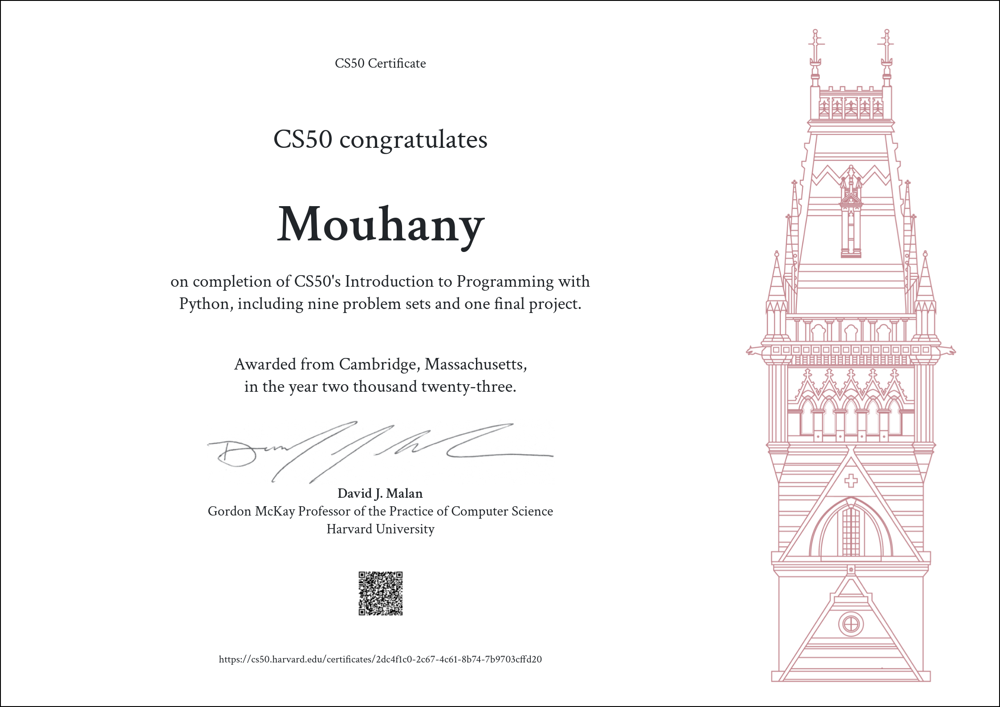

# CS50’s Introduction to Programming with Python

### These are my solutions for CS50's Introduction to Programming with Python 2022.
### Final Project: [Instagram Scraper](https://www.youtube.com/watch?v=rD8VCxQsC5w)
 

## :warning: Disclaimer:

### ❗ **The following codes are for educational purpose only and not intended to be used / submitted as your own solutions.**

### ❗ **Cheating violates the [Academic Honesty](https://cs50.harvard.edu/python/2022/honesty/) of the course, not to mention it's totally pointless if you actually want to learn programming.**

 

## Table of Contents
### [Week 0](/Week%200/) - [Functions, Variables](https://cs50.harvard.edu/python/2022/weeks/0/)
- [Indoor Voice](/Week%200/indoor/)
- [Playback Speed](/Week%200/playback/)
- [Making Faces](/Week%200/faces/)
- [Einstein](/Week%200/einstein/)
- [Tip Calculator](/Week%200/tip/)

### [Week 1](/Week%201/) - [Conditionals](https://cs50.harvard.edu/python/2022/weeks/1/)
- [Deep Thought](/Week%201/deep/)
- [Home Federal Savings Bank](/Week%201/bank/)
- [File Extensions](/Week%201/extensions/)
- [Math Interpreter](/Week%201/interpreter/)
- [Meal Time](/Week%201/meal/)

### [Week 2](/Week%202/) - [Loops](https://cs50.harvard.edu/python/2022/weeks/2/)
- [camelCase](/Week%202/camel/)
- [Coke Machine](/Week%202/coke/)
- [Just setting up my twttr](/Week%202/twttr/)
- [Vanity Plates](/Week%202/plates/)
- [Nutrition Facts](/Week%202/nutrition/)

### [Week 3](/Week%203/) - [Exceptions](https://cs50.harvard.edu/python/2022/weeks/3/)
- [Fuel Gauge](/Week%203/fuel/)
- [Felipe's Taqueria](/Week%203/taqueria/)
- [Grocery List](/Week%203/grocery/)
- [Outdated](/Week%203/outdated/)

### [Week 4](/Week%204/) - [Libraries](https://cs50.harvard.edu/python/2022/weeks/4/)
- [Emojize](/Week%204/emojize/)
- [Frank, Ian and Glen's Letters](/Week%204/figlet/)
- [Adieu, Adieu](/Week%204/adieu/)
- [Guessing Game](/Week%204/game/)
- [Little Professor](/Week%204/professor/)
- [Bitcoin Price Index](/Week%204/bitcoin/)

### [Week 5](/Week%205/) - [Unit Tests](https://cs50.harvard.edu/python/2022/weeks/5/)
- [Testing my twttr](/Week%205/test_twttr/)
- [Back to the Bank](/Week%205/test_bank/)
- [Re-requesting a Vanity Plate](/Week%205/test_plates/)
- [Refueling](/Week%205/test_fuel/)

### [Week 6](/Week%206/) - [File I/O](https://cs50.harvard.edu/python/2022/weeks/6/)
- [Lines of Code](/Week%206/lines/)
- [Pizza Py](/Week%206/pizza/)
- [Scourgify](/Week%206/scourgify/)
- [CS50 P-Shirt](/Week%206/shirt/)

### [Week 7](/Week%207/) - [Regular Expressions](https://cs50.harvard.edu/python/2022/weeks/7/)
- [NUMB3RS](/Week%207/numb3rs/)
- [Watch on YouTube](/Week%207/watch/)
- [Working 9 to 5](/Week%207/working/)
- [Regular, um, Expressions](/Week%207/um/)
- [Response Validation](/Week%207/response/)

### [Week 8](/Week%208/) - [Object-Oriented Programming](https://cs50.harvard.edu/python/2022/weeks/8)
- [Seasons of Love](/Week%208/seasons/)
- [Cookie Jar](/Week%208/jar/)
- [CS50 Shirtificate](/Week%208/shirtificate/)